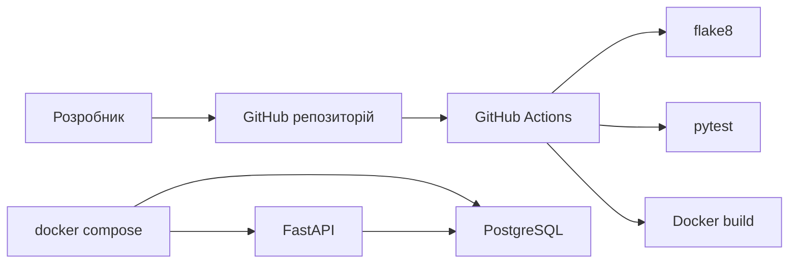

# Звіт до лабораторної роботи 6

## Що потрібно було зробити

У цій лабораторній треба було підготувати проєкт так, щоб його можна було не тільки запускати локально, а й нормально перевіряти та розгортати через DevOps-інструменти. Тобто основний акцент був на Docker, `docker-compose`, автоматичних тестах і CI.

## Що зроблено

У межах роботи я підготував невеликий вебсервіс на FastAPI, який працює з PostgreSQL. Для нього створено `Dockerfile`, окремий `Dockerfile.test`, а також `docker-compose.yaml`, де описано запуск застосунку, бази даних і тестового контейнера.

Окремо налаштовано GitHub Actions. Під час кожного пушу або pull request workflow встановлює залежності, запускає `flake8`, виконує `pytest`, а після цього перевіряє, чи збирається Docker-образ.

Також було оновлено документацію: у `README.md` додано інструкції для локального запуску, запуску через Docker, опис змінних середовища, список основних endpoint-ів, способи перевірки результату та приклади запитів.

## Структура рішення

У підсумку проєкт складається з таких основних частин:

- API на FastAPI
- база даних PostgreSQL
- Docker-конфігурація для запуску
- тестовий контейнер
- CI-конвеєр у GitHub Actions

## Схема роботи

## Що перевірено

Під час виконання роботи були перевірені такі речі:

- `docker compose config`
- збірка образу через `docker build`
- запуск тестів через `docker compose run --build --rm tests`
- перевірка стилю через `flake8`
- робота endpoint-а `GET /health` після запуску контейнерів

Тобто на практиці було підтверджено, що застосунок збирається, запускається і проходить базову автоматичну перевірку.

## Що можна показати на захисті

На демонстрації достатньо показати:

1. репозиторій на GitHub
2. запуск `docker compose up --build`
3. Swagger UI за адресою `http://localhost:8000/docs`
4. виконання `GET /health` і `POST /api/v1/items`
5. успішний запуск GitHub Actions

## Які скріншоти варто додати

- термінал із запущеними контейнерами
- Swagger UI
- результат API-запиту
- зелений CI pipeline у GitHub Actions

## Висновок

У результаті лабораторної роботи проєкт підготовлено до нормального запуску й перевірки: застосунок контейнеризований, база даних підключається через `docker-compose`, тести запускаються окремо, а CI автоматично перевіряє код і збірку. Документація також підготовлена так, щоб було зрозуміло, як цей сервіс запускати і як показати його роботу.
