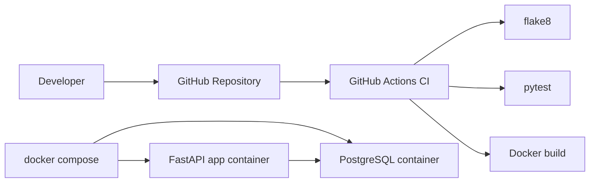

# Laboratory Work 6 Report

## Goal

Automate build, test, and delivery steps for a small web service using Docker and CI/CD tools.

## Project Links

- Repository: `https://github.com/ValeraKozak/l6_ref`
- CI workflow: `https://github.com/ValeraKozak/l6_ref/actions/workflows/ci.yml`
- API docs after local start: `http://localhost:8000/docs`

## Completed Work

- Implemented a sample FastAPI service with PostgreSQL integration.
- Added Docker support through `Dockerfile` and `Dockerfile.test`.
- Added `docker-compose.yaml` for `app + db + tests`.
- Configured CI in GitHub Actions with linting, automated tests, and Docker build.
- Updated `README.md` with run instructions, environment variables, API endpoints, and verification steps.

## Main Steps

1. Created a REST API with endpoints for health checks and item management.
2. Added SQLAlchemy-based database integration.
3. Created automated tests with `pytest`.
4. Containerized the service and test environment with Docker.
5. Added a CI workflow for code quality and build verification.
6. Added end-user and developer documentation with launch, test, and verification instructions.

## Architecture



## Verification Results

- `docker compose config` completed successfully.
- `docker build -t lab6-devops-app:local .` completed successfully.
- `docker compose run --build --rm tests` completed successfully.
- `docker run --rm l6-tests:latest flake8 app tests` completed successfully.
- `GET /health` returned `{"status":"ok"}` after launching `app + db`.

## Key Commands Used

```bash
docker compose up --build
docker compose run --build --rm tests
docker compose down
```

## Materials For Demo

- Show the repository with the CI badge in `README.md`.
- Start containers with `docker compose up --build`.
- Open Swagger UI at `http://localhost:8000/docs`.
- Execute `GET /health` and `POST /api/v1/items`.
- Show the successful GitHub Actions workflow run.

## Screenshots To Include In Submission

1. Docker containers running in terminal.
2. Swagger UI with available endpoints.
3. Successful API request result.
4. Green GitHub Actions pipeline.

## Conclusion

The project satisfies the laboratory requirements: the application is containerized, a multi-service Docker Compose environment is configured, CI checks run automatically in GitHub Actions, and the documentation describes launch, testing, environment variables, API endpoints, and validation steps.
