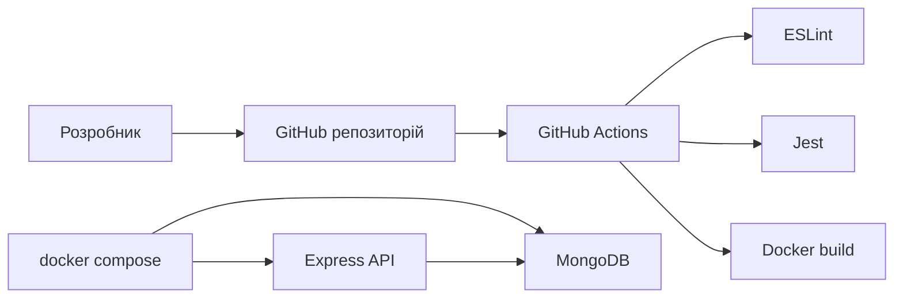

# Звіт до лабораторної роботи 6

## Що було зроблено

Проєкт перероблено під JavaScript. Замість Python-реалізації тепер використовується Node.js та Express. Застосунок працює з MongoDB, має окрему Docker-конфігурацію для запуску і тестування, а також CI-перевірку через GitHub Actions.

## Основні частини проєкту

- API на Node.js + Express
- база даних MongoDB
- `Dockerfile` для застосунку
- `Dockerfile.test` для тестів
- `docker-compose.yaml` для зв’язки `app + db + tests`
- CI-конвеєр у GitHub Actions
- браузерна документація API через `/docs`

## Що перевіряється в CI

Під час push або pull request workflow:

1. встановлює npm-залежності
2. запускає `eslint`
3. запускає `jest`, включаючи інтеграційний тест із MongoDB
4. збирає Docker-образ

## Схема роботи

## Як можна показати роботу на захисті

1. показати репозиторій на GitHub
2. запустити `docker compose up --build`
3. відкрити `http://localhost:8000/docs`
4. перевірити `GET /health`
5. створити запис через `POST /api/v1/items`
6. показати зелений workflow у GitHub Actions

## Що стало сильнішим після доопрацювання

- тести перевіряють не тільки логіку endpoint-ів, а й реальну роботу з MongoDB
- Docker і CI використовують той самий стек, що й сам застосунок
- документація узгоджена з JavaScript-реалізацією
- є браузерна сторінка `/docs`, яку зручно показувати на захисті

## Які скріншоти варто додати

- термінал із запущеними контейнерами
- сторінка `/docs` у браузері
- успішний запит до `GET /health`
- створення елемента через `POST /api/v1/items`
- успішний CI pipeline у GitHub Actions

## Посилання для демо

- Репозиторій: `https://github.com/ValeraKozak/l6_ref`
- CI workflow: `https://github.com/ValeraKozak/l6_ref/actions/workflows/ci.yml`
- Локальна документація API: `http://localhost:8000/docs`
- GIF/відео демо: додати перед здачею

## Висновок

У результаті лабораторної роботи проєкт переведено на JavaScript і підготовлено до контейнеризованого запуску та автоматичної перевірки. Є окремі конфігурації для застосунку й тестів, багатоконтейнерний запуск через Docker Compose, CI-процес для перевірки коду і збірки, а також браузерна документація API для зручної демонстрації.
